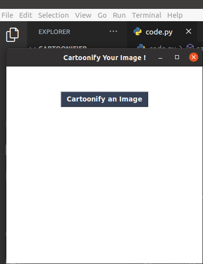
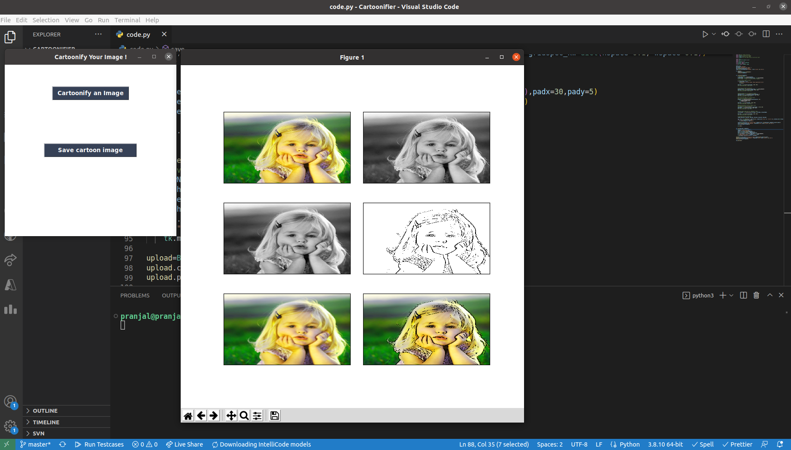

# Image-cartoonifier

This python code generates a cartoonified image of the image uploaded by user.
When the code is run in the terminal, it opens a message box:

We have to click on the button showing "Cartoonify an Image"

After clicking, a filebox opens where the user can select an image from local machine to cartoonify.The filebox opens the directory in which the user is running the python code file.

User can select an image and upload.

After selecting, user must click on open button and then the python code file generates cartoonified image.

There are 5 steps shown hows image is initially converted to grayscale, edges smoothened, image edges retrieved and then masked using OpenCV

User can also save the end result i.e. the cartoonified image by clicking on the "Save Cartoon Image" button shown.

After saving the image, user is provided with a message about the exact location where the image is saved.

